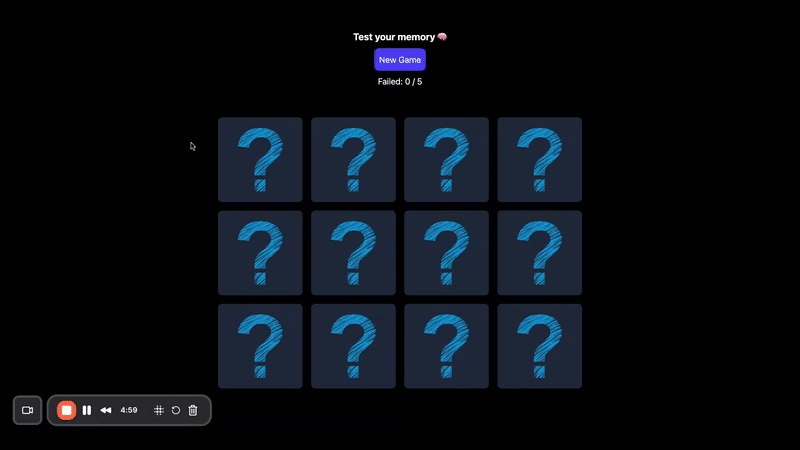

# Simple memory game built with React + TypeScript + Tailwind CSS

This documentation provides instructions for setting up and running the project.



## Table of Contents
- [Prerequisites](#prerequisites)
- [Setup](#setup)
- [Running the Project](#running-the-project)
- [Docker Commands](#docker-commands)

## Prerequisites
- Docker and Docker Compose
- Git

## Setup
Clone the repository:
```bash
git clone https://github.com/bricioo/react.git
cd 1-memory-game
```

## Running the Project
```bash
./docker.sh up
```
Once the containers are up, you can access the application at `http://localhost:5173`.

## Docker Commands
| Command | Description |
|---------|-------------|
| ./docker.sh up | Build and start containers |
| ./docker.sh logs | View container logs |
| ./docker.sh down | Stop containers |